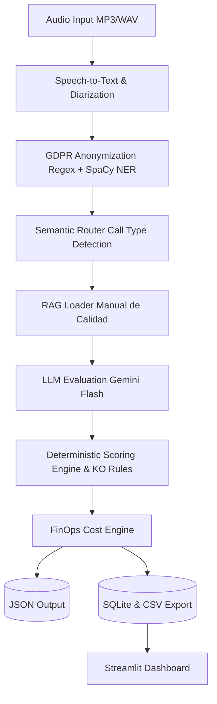
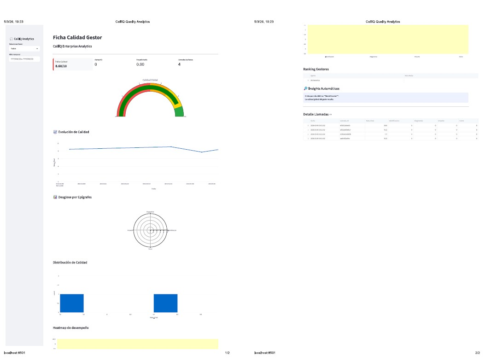
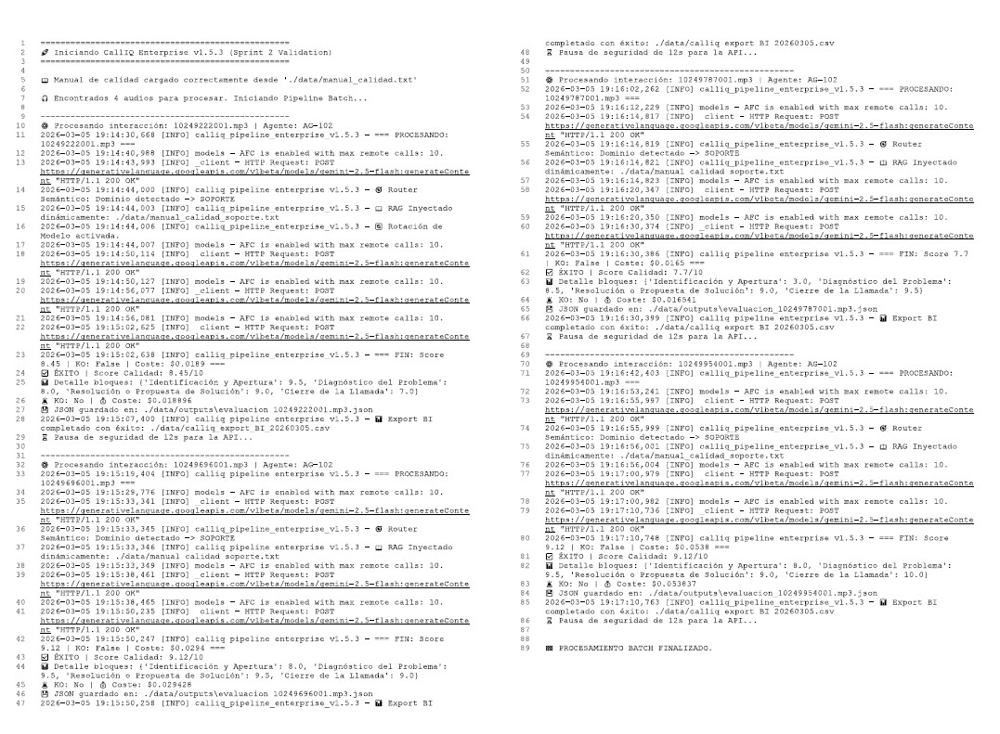

# CallIQ Enterprise v1.5.4 (Multi-Domain)

**Motor de Evaluación Automática de Calidad Conversacional con Inteligencia Artificial**

CallIQ Enterprise es un sistema de análisis automático de interacciones de contact center que combina **modelos de lenguaje (LLM)** con **algoritmos deterministas** para evaluar la calidad de conversaciones entre agentes y clientes.

El diseño del sistema separa explícitamente:
* **Comprensión semántica mediante LLM**
* **Cálculo determinista del score en Python**

Esta arquitectura híbrida permite trazabilidad completa del proceso, reproducibilidad del scoring, control de alucinaciones del modelo y auditabilidad en entornos regulados.

---

## Objetivo del Proyecto

Demostrar la viabilidad técnica de un sistema capaz de:
* Analizar automáticamente interacciones de voz.
* Clasificar dinámicamente el tipo de llamada.
* Evaluar la calidad del agente mediante manuales operativos inyectados dinámicamente (RAG).
* Reducir el coste de auditoría manual optimizando el TCO (FinOps).
* Generar métricas estructuradas para Business Intelligence.

---

## 🧩 Características Principales

* **Evaluación automática de calidad conversacional.**
* **Arquitectura modular desacoplada.**
* **Clasificación semántica (Zero-Shot)** del tipo de interacción.
* **Evaluación híbrida:** LLM para extracción de contexto + reglas deterministas para puntuación matemática.
* **Anonimización de datos sensibles (GDPR):** Borrado lógico mediante Regex y SpaCy (NER).
* **Escudo de seguridad:** Protección contra Prompt Injection y validación de integridad (Hashes SHA256).
* **Dashboard analítico** en Streamlit.
* **Exportación de resultados a CSV / BI.**

---

## 🏗️ Arquitectura de Procesamiento

El sistema sigue una arquitectura de pipeline donde cada módulo tiene una responsabilidad única y clara.



---

# ⚙️ Componentes del Sistema

| Componente                   | Función                              |
| ---------------------------- | ------------------------------------ |
| IngestionModule              | Ingesta de audios y transcripción    |
| AnonymizationModule          | Anonimización de datos sensibles     |
| Semantic Router              | Clasificación del tipo de llamada    |
| Evaluation Model Builder     | Interpretación del manual de calidad |
| Dynamic Evaluation Engine    | Evaluación semántica mediante LLM    |
| Deterministic Scoring Engine | Cálculo matemático del score         |
| FinOps Engine                | Cálculo de coste por interacción     |

---

# 📊 Dashboard Analítico

El sistema incluye un **dashboard interactivo desarrollado en Streamlit** para analizar las métricas generadas.

Características principales:

* Índice de calidad global con velocímetro
* Evolución temporal de la calidad
* Radar de epígrafes de evaluación
* Heatmap de desempeño
* Ranking de gestores
* Insights automáticos

<p align="center">

</p>

---

# 🛠️ Requisitos e Instalación

## 1. Clonar el repositorio

```bash
git clone [https://github.com/tu-usuario/calliq-enterprise.git](https://github.com/tu-usuario/calliq-enterprise.git)
cd calliq-enterprise
```

---

## 2. Crear entorno virtual

```bash
python -m venv venv
```

Activar entorno:

Windows

```bash
.\venv\Scripts\activate
```

Linux / Mac

```bash
source venv/bin/activate
```

---

## 3. Instalar dependencias

```bash
pip install -r requirements.txt
```

Instalar modelo de SpaCy:

```bash
python -m spacy download es_core_news_md
```
Nota:  Para el correcto procesamiento de ciertos formatos de audio, es recomendable tener instalado ffmpeg en el sistema
---

# 🔑 Configuración de Variables de Entorno

Crear un archivo `.env` en la raíz del proyecto.

```
ASSEMBLYAI_API_KEY=tu_clave_de_assemblyai
GEMINI_API_KEY=tu_clave_de_google_gemini
```

---

# 📁 Estructura de Datos

```
data/
 ├── audios/
 ├── outputs/
 ├── manual_calidad.txt
 ├── manual_calidad_ventas.txt
 ├── manual_calidad_soporte.txt
 └── manual_calidad_retencion.txt
```

* **audios/** → grabaciones de entrada
* **outputs/** → evaluaciones generadas en JSON

---

# ▶️ Ejecución del Sistema

## Procesar audios

```bash
python calliq_pipeline_enterprise_v1.5.3.py
```

El sistema ejecutará las siguientes acciones secuenciales:

Procesamiento de los audios (Speech-to-Text).

Anonimización (NLP/Regex).

Evaluación semántica (LLM) y puntuación matemática.

Generación de un archivo JSON por interacción.

Exportación de métricas a CSV para BI.

<p align="center">

</p>

## Lanzar dashboard

```bash
streamlit run app.py
```

---

# 📊 Exportación para BI

El sistema genera automáticamente un archivo CSV con métricas estructuradas.

Ejemplo:

| conversation_id | agent_id | score | KO    |
| --------------- | -------- | ----- | ----- |
| 10249222001     | AG-102   | 8.45  | False |
| 10249696001     | AG-102   | 9.12  | False |

Este dataset puede integrarse con:

* Power BI
* Tableau
* herramientas de reporting

---

# 🔭 Limitaciones y Roadmap

Este sistema es un prototipo avanzado desarrollado en un entorno académico. Presenta algunas limitaciones y líneas de mejora futuras:

* Procesamiento secuencial de llamadas (evolución futura a procesamiento asíncrono Batch API para grandes volúmenes).

* Dependencia actual de APIs externas sin despliegue en infraestructura cloud propia.

* Evolución planificada del router semántico hacia el uso de embeddings vectoriales para mayor eficiencia en costes.

* Integración nativa futura con plataformas CCaaS (Genesys Cloud, Amazon Connect, etc.).
---

# 👨‍💻 Autores

EOI - Grupo 3 - (abril 2025)


Proyecto desarrollado como investigación sobre **inteligencia conversacional aplicada a contact centers**.


